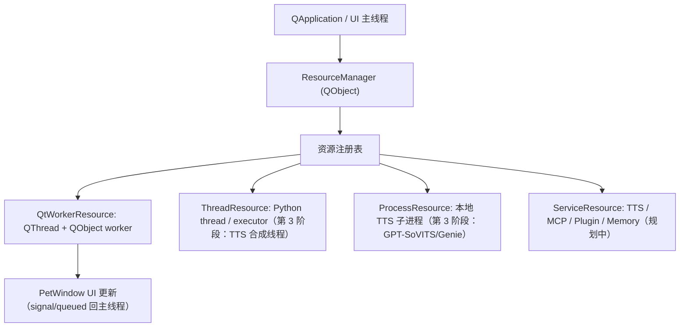

# 运行时资源管理器（ResourceManager）设计与路线图

> 对应 issue #94。本文定义 Sakura 后端资源管理层的目标架构、资源状态机、线程域与关闭顺序，
> 并记录分阶段落地范围。**当前分支只落地第 1+2 阶段**（QThread worker 生命周期托管），
> 其余阶段为待实现的契约。

## 背景：三套生命周期模型

Sakura 同时跨越三套对象生命周期模型：

```text
CPython 引用计数 / GC
      +
PySide / Shiboken wrapper ownership
      +
Qt C++ QObject / QThread / event loop / parent-child ownership
```

CPython 只能可靠管理 Python 对象。Qt 的 C++ 对象有自己的 parent-child、thread affinity、
`deleteLater()` 与 event-loop 释放语义；PySide 只是桥接层。只要 Python wrapper、C++ QObject、
线程归属、queued event 的生命周期不同步，就可能出现普通 `try/except` 捕不到的 native crash
（退出、测试隔离、配置切换时尤甚）。

在重构前，这些生命周期细节散落在 `app/ui/pet_window.py`（6700+ 行）里：`PetWindow` 同时是
UI、生命周期管理器、服务注入器、线程持有者与关闭协调器。6 个 QThread worker 的
「创建 → moveToThread → 接线 → quit → cleanup → 关闭」是逐字重复的样板。

## 目标：资源管理器，而不是「把所有东西丢出主线程」

要建的是一个**运行时资源层**，统一管理生命周期、健康状态、关闭顺序、重启策略与跨线程投递；
**不是**把所有 Qt 对象都移出主线程。正确边界：

- **必须留在 UI 主线程**：`QWidget` / `QPixmap` / `QMediaPlayer` / `QAudioOutput` / Qt UI 定时器。
- **可被后台资源托管**：TTS HTTP 合成、本地 TTS 服务进程、模型加载、MCP bridge、memory preload、
  接话 hybrid 分类、截图编码。
- **统一交给资源管理器**：QObject 生命周期、QThread stop/join/deleteLater、Python thread shutdown、
  subprocess restart——而不是散落在 `PetWindow`。



## 资源状态机

所有受管资源对外暴露统一状态（完整状态机为后续 Service/Process 资源准备；
第 1+2 阶段的 `QtWorkerResource` 只用到其中的 `STARTING/READY/STOPPING/STOPPED` 子集）：

```text
NEW → STARTING → READY → STOPPING → STOPPED
                   │
                   ├──→ DEGRADED  （健康检查失败但仍在跑，可重启）
                   └──→ FAILED    （不可恢复）
```

| 状态 | 含义 |
| --- | --- |
| `NEW` | 已创建未启动 |
| `STARTING` | 启动中（建线程 / 起进程 / 连接） |
| `READY` | 正常运行 |
| `DEGRADED` | 健康检查失败但仍存活，可触发 `restart()` |
| `STOPPING` | 关闭中（cancel → quit/stop → wait/join） |
| `STOPPED` | 已干净停止 |
| `FAILED` | 不可恢复错误 |

## 线程域（thread domain）

资源必须标记其归属线程域，禁止把 UI-only 对象移出主线程：

| 线程域 | 适用对象 |
| --- | --- |
| `MAIN_THREAD_ONLY` | QWidget / QPixmap / QMediaPlayer / QAudioOutput / Qt UI timer |
| `QT_WORKER_THREAD` | 移入 QThread 的 QObject worker（ChatWorker 等） |
| `PYTHON_THREAD` | 裸 Python thread / executor（memory preload、接话分类） |
| `PROCESS` | 本地子进程（GPT-SoVITS / Genie） |
| `ASYNC_LOOP_THREAD` | 独立 asyncio 事件循环线程（MCP bridge） |

## ManagedResource 契约

后续阶段的 Service/Process 资源统一实现：

```text
start()              启动
stop(timeout)        请求停止并在 timeout 内等待，返回是否干净停止
restart(reason)      重启（健康检查失败 / Broken pipe 等）
health()             返回健康状态
close()              释放
state_changed        状态变更信号
```

第 1+2 阶段的 `QtWorkerResource` 只实现该契约中 worker 生命周期所需的最小子集
（`stop` / `is_running` / 内部 cleanup）；`restart` / `health` / `state_changed` 留待 Service 资源。

## 关闭顺序

`PetWindow.close_external_tools()` 触发的关闭顺序（保持现状语义）：

1. 发出 app-closed 事件、停 speaking watchdog、取消字幕流。
2. 接话控制器 `shutdown(timeout)`（join 后台分类线程，超时则后台自然完成）。
3. **`ResourceManager.stop_all(timeout)`**：对每个受管 QThread worker 执行
   `cancel() → requestInterruption() → quit() → wait(timeout)`；超时未结束则转入 *lingering*
   （保留 Python wrapper + 连接 `finished → deleteLater`），不阻塞 UI 退出。
4. 关闭 TTS / MCP / 插件 / renderer。

### lingering 与 wrapper 保留

两个 native 安全机制由 ResourceManager 集中持有：

- **lingering 线程**：`wait(timeout)` 超时的 QThread 不强杀，保留 `(thread, worker)` 引用并连接
  `thread.finished → deleteLater`，让它在后台自然结束，避免在 UI 退出路径上长时间阻塞或强杀崩溃。
- **wrapper 保留窗口**：queued 信号可能在 Qt 正在销毁同一 QObject 时到达 Python；若此刻丢掉最后一个
  Python wrapper 引用，Shiboken 可能去销毁一个 C++ 生命周期已由 Qt 接管的对象（double-destruction）。
  `retain_wrappers()` 把退役 wrapper 暂存 1 秒后再 prune，避开该竞态窗口。

## 分阶段路线图

| 阶段 | 范围 | 风险 | 收益 | 状态 |
| --- | --- | --- | --- | --- |
| 1 | ResourceManager 基础设施 + 迁出生命周期工具 | 低 | 生命周期集中 | ✅ 本分支 |
| 2 | 托管 6 个现有 QThread worker | 中低 | 直接降低 Qt 退出/测试崩溃 | ✅ 本分支 |
| 3 | 拆分 TTS Provider（服务进程 / 合成队列 / 播放端点） | 中高 | 解决 TTS 重启/播放/进程混杂 | ⏳ 待定 |
| 4 | 接话模块资源化 | 中 | 分类线程关闭更可靠 | ⏳ 待定 |
| 5 | memory / MCP / plugin 统一治理 | 中高 | native/thread 资源统一 | ⏳ 待定 |

### 第 1+2 阶段已落地内容

- 新增 `app/core/resource_manager.py`：
  - `QtWorkerResource`——托管一对 `QThread + QObject worker` 的完整生命周期。
  - `ResourceManager`（`QObject`，活在 UI 主线程）——`spawn_qt_worker()` 工厂、`stop_all()`、
    集中的 lingering 列表与 wrapper 保留/prune。
- `PetWindow` 的 `_shutdown_qthread` / `_keep/_release_shutdown_lingering_thread` /
  `_retain/_prune_qobject_wrappers` 迁出到 ResourceManager；窗口改为委托调用。
- 6 个 worker 创建点（`ChatWorker`、`EventWorker`、`MemoryCurationWorker`、
  `DeferredStartupWorker`、`TTSReadyWarmupWorker`、`ScreenObservationEncodeWorker`）改用
  `spawn_qt_worker()`，行为与现状逐字等价。

> 设计取向：第一版保持克制。`PetWindow` 仍持有 `self.worker` 等属性（指向 manager 创建的对象），
> 让现有处理器与既有测试断言无需改写；manager 只接管「样板接线 + 关闭 + wrapper 治理」。

## 风险与约束（落地时必须遵守）

1. **不要误移 Qt 对象线程**：`MAIN_THREAD_ONLY` 域对象禁止 `moveToThread`。
2. **关闭不死锁**：UI 线程同步 `wait()` worker 时，worker 若还需 UI 线程处理 queued 信号即死锁；
   关闭路径用有限 timeout + lingering，绝不无限阻塞 UI。
3. **TTS 行为不回归**（第 3 阶段）：prepare、播放完成回调、fallback timeout、Broken pipe 重启、
   临时 wav 清理语义必须保留。
4. **插件兼容**：插件只能经 service facade，ResourceManager 改造不得让插件接触 `PetWindow` 或 TTS 内部实例。
5. **测试桩同步**：`tests/ui/test_pet_window.py` 的 `ThreadStub`/`WorkerStub` 依赖精确关闭序列；
   `tests/conftest.py` 的 `_cleanup_qt_objects` 靠 parent-child 递归回收线程——QThread 必须保持
   parent 到窗口。
